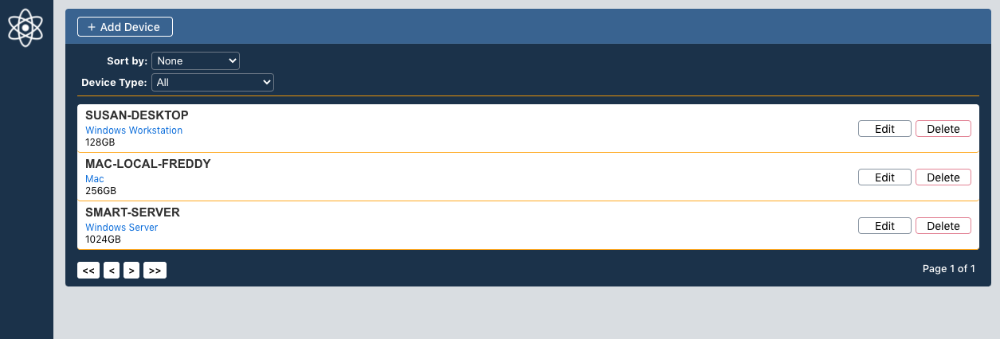
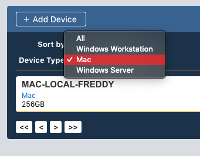
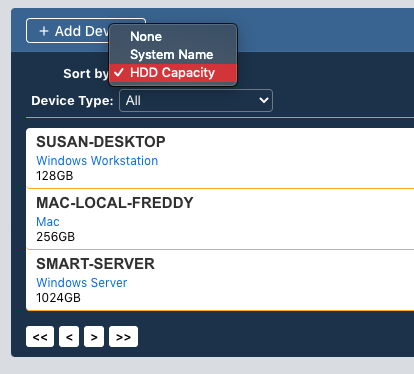
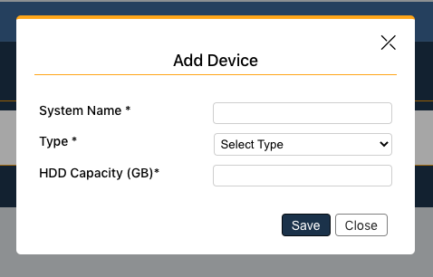
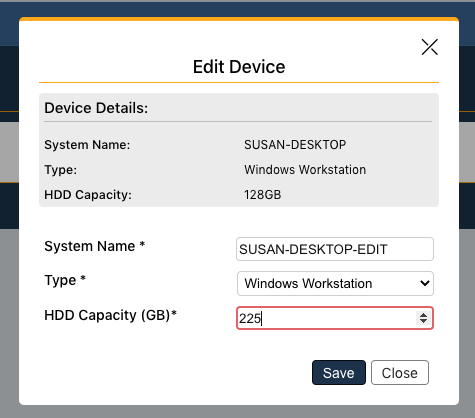
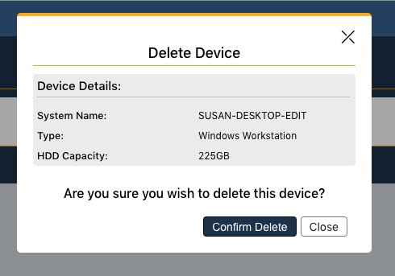

# **Devices (Client-Application) with ReactJS**


## Quick Features
- **Add** new devices to the dashboard
- **Edit** devices in the dashboard 
- **Delete** devices from the dashboard
- **Filter** devices by Type
- **Sort** devices by Name or HDD Capacity


&nbsp;

## Installation
---
Install all dependencies and start the client (Client runs at **localhost:3001**).

```sh
cd devices-clientapp
npm install
npm start
```
---

&nbsp;

## Table Documentation
---
Column Structure for each Table Object:

```javascript
const columns = [
    {
        accessor: 'system_name',
        filterName: '',
        Filter: '',
        filter: '',
        Cell: (row) => <div className="devices-table-row-data-system-name">{row.value}</div>
    },
    {
         accessor: 'type',
        filterName: 'Device Type:',
        Filter: SelectColumnFilter,
        filter: 'includes',
        Cell: (row) => <div className="devices-table-row-data-type">{row.value}</div>
    },
    {
        accessor: 'hdd_capacity',
        filterName: '',
        Filter: '',
        filter: '',
        Cell: (row) => <div className="devices-table-row-data-hdd-capacity">{row.value}GB</div>
    },
    {
        accessor: 'edit_data',
        filterName: '',
        Filter: '',
        filter: '',
        Cell: (row) => <div className="devices-table-edit-device-button" onClick={() => editClickHandler(row.value)}>Edit</div>
    },
    {
        accessor: 'delete_data',
        filterName: '',
        Filter: '',
        filter: '',
        Cell: (row) => <div className="devices-table-delete-device-button" onClick={() => deleteClickHandler(row.value)}>Delete</div>
    }
];
```

Table Setup:
```javascript
const {
        getTableProps,
        getTableBodyProps,
        headerGroups,
        prepareRow,
        page,
        canPreviousPage,
        canNextPage,
        pageOptions,
        pageCount,
        gotoPage,
        nextPage,
        previousPage,
        state: { pageIndex },
    } = useTable({ 
        columns, 
        data,
        initialState: {
            filters: [{
                id: 'type',
                value: localStorage.getItem('filter-setting')
            }]
        }
    }, useFilters, useSortBy, usePagination)
```
---

&nbsp;

## API Documentation
---
#### Device Properties:
```javascript
const device = {
    id: "1",
    system_name: "Name",
    type: "Mac",
    hdd_capacity: "100"
}
```

#### Get all devices (API call):
```javascript
axios.get(`API_Endpoint`).then((response) => { console.log("Get Response: ", response); });
```

#### Add a new device (API call):
```javascript
const data = {
    system_name: "Name",
    type: "Mac",
    hdd_capacity: "100"
};

axios.post(`API_Endpoint`, data).then((response) => { console.log("Post Response: ", response); });
```

#### Edit a device (API call):
```javascript
axios.put(`API_Endpoint/DEVICE_ID`, data).then((response) => { console.log("Put Response: ", response); });
```

#### Delete a device (API call):
```javascript
axios.delete(`API_Endpoint/DEVICE_ID`).then((response) => { console.log("Delete Response: ", response); });
```

&nbsp;

## Styles &nbsp; | &nbsp; Views &nbsp; | &nbsp; Features
---
The dashboard table view is built using [React-Table](https://github.com/tannerlinsley/react-table).
- All component styling is located in ***App.css***

&nbsp;

---
### **Main Dashboard View**
##### *The main dashboard presents existing devices. Each device has a name, type, and HDD capacity.*
---


---
### **Filtering Functionality**
##### *The table contains a filtering feature that allows for device type filtering.*
---


---
### **Sorting Functionality**
##### *The table contains a sorting feature that allows for name and HDD capacity sorting.*
---


---
### **Adding a New Device**
##### *New devices can be added using the add modal.*
---


---
### **Editing an Existing Device**
##### *Existing devices can be edited using the edit modal.*
---


---
### **Deleting an Existing Device**
##### *Existing devices can be deleted using the delete modal.*
---


---

&nbsp;

## Testing
---
### What is tested (_Unit Tests_):

- Successful rendering of each component.
- Modal rendering after a button click event has occurred.
- Input value changes and updates.
- Successful and unsuccessful mock API calls for adding, editing, and deleting devices.
- Successful and unsuccessful table data population.

&nbsp;

Run existing unit tests.

```sh
npm test
```
---